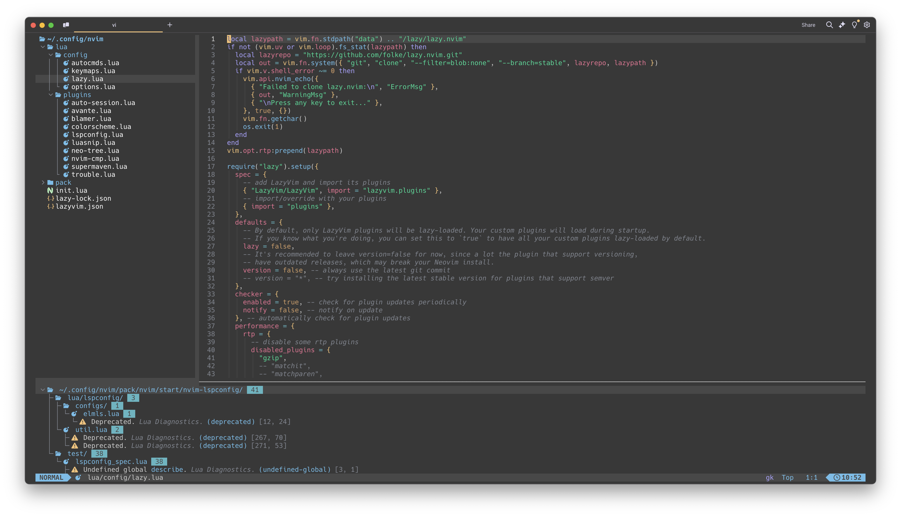

# smooth.nvim

Personal smooth theme implementation for Neovim.



## Installation

### Lazy

```lua
return {
 {
  "segersniels/smooth.nvim",
  name = "smooth",
  lazy = true,
  opts = {
    style = "dark", -- "dark" or "light"
  },
 },
 {
  "LazyVim/LazyVim",
  opts = {
   colorscheme = "smooth",
  },
 },
}
```
